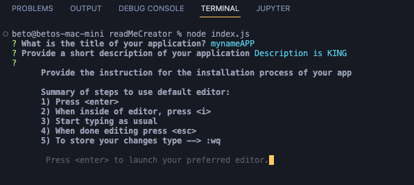

# readMeCreator

## Description
When creating an open source project on GitHub, it’s important to have a high-quality README for the app. This should include what the app is for, how to use the app, how to install it, how to report issues, and how to make contributions.

With this node.js app, you can quickly and easily create a README file by using a command-line application to generate one. This allows the project creator to devote more time to working on the project.

## Table of Contents
- [Prerequisites](#prerequisites)
- [Installation](#installation)
- [Usage](#usage)
- [Credits](#credits)
- [License](#license)

## Prerequisites
* Since this is a node.js app, you will need to install node.js in your laptop.  
    * Download the latest version of node.js here --> https://nodejs.org/en/download/  
* After node.js has been installed on your machine, you will need to install npm.  
    * Follow the steps in the following website to install npm --> https://docs.npmjs.com/cli/v9/commands/npm-install?v=true  

Once those two prerequisites have been installed on your laptop proceed to the Installation steps  

## Installation
1) Clone or download the ZIP to your local repository
2) Open a CLI terminal
3) Navigate to your <code>readMeCreator</code> folder 
4) Run the <code>index.js</code> with the following command:
    <pre>node index.js</pre>

## Usage
Provide a fast way to provide a <code>README.md</code> template by leveraging <code>node.js</code> to generate it. Utilizing this app speeds up the readme creation and inherently allows the project creator to devote more time to working on the actual project.

## Credits
* Me
* Myself
* I

Alberto De Armas --> https://github.com/nosbeto

## License

MIT License

Copyright (c) [2022] [Alberto De Armas]

Permission is hereby granted, free of charge, to any person obtaining a copy
of this software and associated documentation files (the "Software"), to deal
in the Software without restriction, including without limitation the rights
to use, copy, modify, merge, publish, distribute, sublicense, and/or sell
copies of the Software, and to permit persons to whom the Software is
furnished to do so, subject to the following conditions:

The above copyright notice and this permission notice shall be included in all
copies or substantial portions of the Software.

THE SOFTWARE IS PROVIDED "AS IS", WITHOUT WARRANTY OF ANY KIND, EXPRESS OR
IMPLIED, INCLUDING BUT NOT LIMITED TO THE WARRANTIES OF MERCHANTABILITY,
FITNESS FOR A PARTICULAR PURPOSE AND NONINFRINGEMENT. IN NO EVENT SHALL THE
AUTHORS OR COPYRIGHT HOLDERS BE LIABLE FOR ANY CLAIM, DAMAGES OR OTHER
LIABILITY, WHETHER IN AN ACTION OF CONTRACT, TORT OR OTHERWISE, ARISING FROM,
OUT OF OR IN CONNECTION WITH THE SOFTWARE OR THE USE OR OTHER DEALINGS IN THE
SOFTWARE.